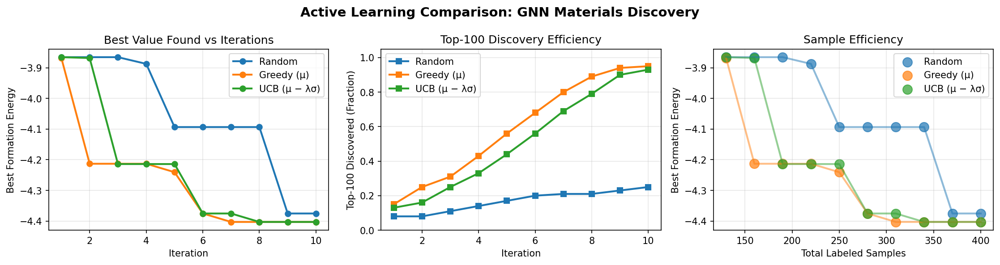

# GNoME-style Active Learning for Materials Discovery


A GNoME-inspired active learning pipeline for identifying stable inorganic materials using a pre-trained [CHGNet](https://github.com/CederGroupHub/chgnet) surrogate with Monte Carlo Dropout uncertainty estimation. Motivated by DeepMind's [GNoME paper (Merchant et al., Nature 2023)](https://www.nature.com/articles/s41586-023-06735-9), this project investigates how uncertainty-aware acquisition strategies compare to greedy baselines when the labeling budget is small relative to the candidate pool.

## Key Result

> With only **20% of the candidate budget labeled** (400 / 2000 structures), both Greedy and UCB acquisition discovered **93–95% of the top-100 most stable structures** in the pool — compared to **25% for random sampling**.

| Strategy      | Top-100 Recall | Best Found (eV/atom) | Labeled |
|---------------|:--------------:|:--------------------:|:-------:|
| Random        | 25%            | −4.375               | 400 / 2000 |
| Greedy (μ)    | **95%**        | −4.403               | 400 / 2000 |
| UCB (λ=1.0)   | **93%**        | −4.403               | 400 / 2000 |

The result that Greedy ≈ UCB here is itself informative: CHGNet's physics-informed pre-trained representations are accurate enough that the frozen backbone's mean predictions already provide strong signal, leaving limited room for uncertainty-driven exploration to improve on pure exploitation in a pool of this size.

## Method

```
Materials Project pool (2000 structures)
         │
         ▼
  CHGNet graph_converter → CrystalGraph objects (pre-computed once)
         │
   ┌─────┴──────────────────────────────────┐
   │  Active Learning Loop (10 iterations)  │
   │                                        │
   │  1. Fine-tune CHGNet MLP head          │
   │     on labeled set (frozen backbone)   │
   │                                        │
   │  2. MC Dropout inference               │
   │     N=10 forward passes → μ, σ         │
   │                                        │
   │  3. Acquisition: select top-30 by      │
   │     score(x) = μ(x) − λ·σ(x)          │
   │                                        │
   │  4. Query ground-truth DFT energy      │
   │     (oracle from Materials Project)    │
   └─────────────────────────────────────────┘
         │
         ▼
  Track: best formation energy found,
         top-100 recall @ each iteration
```

**Surrogate model**: CHGNet v0.3.0 (412,525 total parameters). The atom/bond/angle convolution layers are frozen; only the 12,738-parameter MLP head is fine-tuned each iteration. Dropout (p=0.3) is enabled in the MLP head during inference to produce MC Dropout uncertainty estimates.

**Acquisition**:
- `RandomStrategy`: uniform random sampling (baseline)
- `GreedyStrategy`: select by lowest predicted μ (pure exploitation)
- `UCBStrategy`: select by `μ(x) − λ·σ(x)`, λ=1.0 (exploration–exploitation tradeoff)

## Results



## Setup

**Requirements**: Python 3.9+, ~4 GB disk for Materials Project cache

```bash
git clone https://github.com/0xSoftBoi/gnome-materials.git
cd gnome-materials
python3 -m venv venv
source venv/bin/activate   # Windows: venv\Scripts\activate
pip install -r requirements.txt
```

**Materials Project API key**: The CHGNet experiment downloads 83,794 DFT-computed structures from the [Materials Project](https://materialsproject.org/). You need a free API key:

```bash
export MP_API_KEY="your_api_key_here"  # or set in shell profile
```

Get a key at [materialsproject.org/api](https://next-gen.materialsproject.org/api).

## Reproducing the Experiment

```bash
# CHGNet surrogate experiment (main result — ~2 hours on CPU)
python3 main.py --experiment chgnet

# Synthetic GNN scaling analysis
python3 main.py --experiment scaling

# UCB lambda sensitivity (λ ∈ {0.0, 0.5, 1.0, 2.0, 5.0})
python3 main.py --experiment lambda
```

Output plots are saved to `results/`. The Materials Project structure cache (`data/mp_cache/structures_raw.pt`) is created on first run and reused on subsequent runs.

## Dataset

- **Source**: [Materials Project](https://materialsproject.org/) via `mp-api`
- **Pool**: 2,000 structures sampled from 83,794 entries with `energy_above_hull ≤ 0.1 eV/atom` (near-stable compounds)
- **Labels**: DFT formation energy per atom (GGA/GGA+U), queried as ground truth during active learning
- **Initial training set**: 100 randomly sampled structures (5% of pool)
- **Budget**: 10 iterations × 30 structures/iteration = 300 additional labels (15% of pool)

## Implementation Notes

**Why CPU?** CHGNet is forced to CPU via `CHGNet.load(use_device='cpu')`. On Apple Silicon with 16 GB unified memory, pre-computing 2,000 CrystalGraphs and accumulating gradients through the backbone during fine-tuning causes silent OOM kills on MPS. CPU and MPS have comparable throughput for this GNN at this batch size.

**Shared graph cache**: All 2,000 CrystalGraph objects are pre-computed once and shared across the three strategy runs (≈60 ms/structure × 2,000 = ~2 min one-time cost). Without this, graph conversion would dominate per-iteration runtime.

**MC Dropout on head only**: `model.eval(); model.mlp.train()` — backbone is in eval mode (no dropout), only the MLP head has dropout active during inference. The pre-trained CHGNet backbone has p=0 dropout; p=0.3 is set explicitly on the MLP head in `CHGNetSurrogate.__init__`.

## Project Structure

```
gnome-materials/
├── main.py                        # Experiment entry points (--experiment flag)
├── requirements.txt
├── data/
│   ├── dataset.py                 # Synthetic crystal dataset (scaling/lambda experiments)
│   ├── mp_dataset.py              # Materials Project graph dataset
│   └── mp_dataset_chgnet.py       # Materials Project raw-structure dataset for CHGNet
├── model/
│   ├── gnn.py                     # GNN + MC Dropout (synthetic experiments)
│   └── chgnet_surrogate.py        # CHGNet fine-tuning + MC Dropout wrapper
├── active_learning/
│   ├── strategies.py              # Random / Greedy / UCB
│   ├── loop.py                    # AL loop (synthetic GNN)
│   └── loop_chgnet.py             # AL loop (CHGNet surrogate)
└── evaluation/
    └── metrics.py                 # Plotting and summary statistics
```

## Citation

If this work is useful, please also cite the underlying tools and datasets:

```bibtex
@article{merchant2023gnome,
  title   = {Scaling deep learning for materials discovery},
  author  = {Merchant, Amil and Batzner, Simon and Schoenholz, Samuel S and
             Aykol, Muratahan and Cheon, Gowoon and Cubuk, Ekin Dogus},
  journal = {Nature},
  volume  = {624},
  pages   = {80--85},
  year    = {2023},
  doi     = {10.1038/s41586-023-06735-9}
}

@article{deng2023chgnet,
  title   = {{CHGNet} as a pretrained universal neural network potential for
             charge-informed atomistic modelling},
  author  = {Deng, Bowen and Zhong, Peichen and Jun, KyuJung and Riebesell, Janosh
             and Han, Kevin and Bartel, Christopher J and Ceder, Gerbrand},
  journal = {Nature Machine Intelligence},
  volume  = {5},
  pages   = {1031--1041},
  year    = {2023},
  doi     = {10.1038/s42256-023-00716-3}
}

@inproceedings{gal2016dropout,
  title     = {Dropout as a {B}ayesian Approximation: Representing Model Uncertainty
               in Deep Learning},
  author    = {Gal, Yarin and Ghahramani, Zoubin},
  booktitle = {Proceedings of the 33rd International Conference on Machine Learning},
  year      = {2016},
  url       = {https://arxiv.org/abs/1506.02142}
}
```

**Materials Project**: Jain, A. et al. *APL Materials* 1, 011002 (2013). [doi:10.1063/1.4812323](https://doi.org/10.1063/1.4812323)
